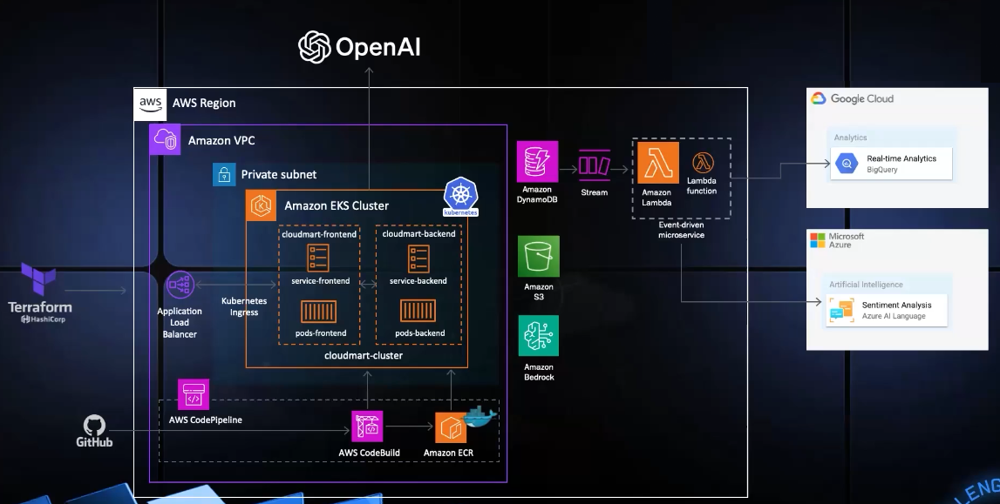
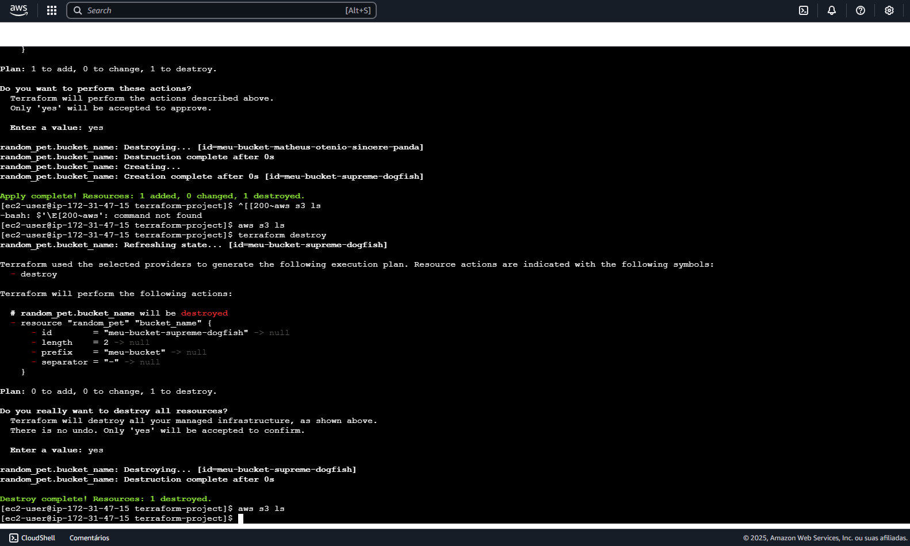
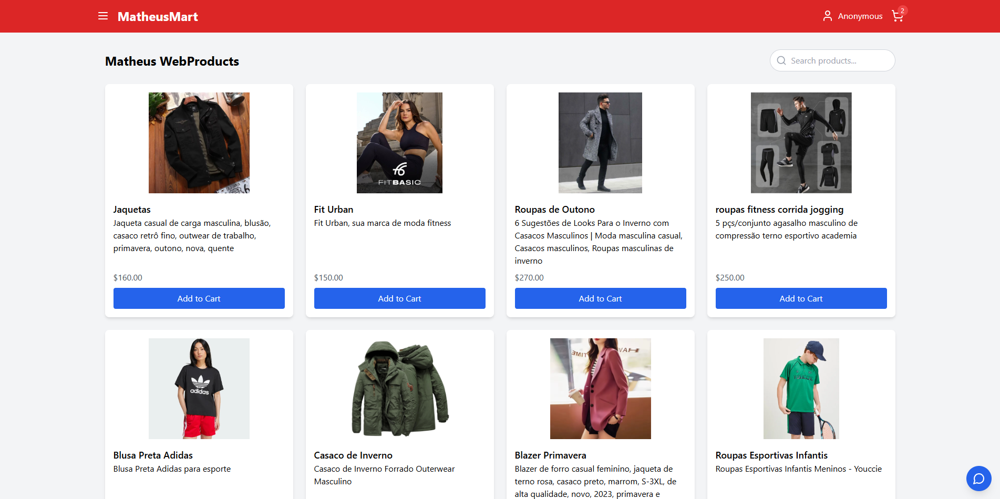

# MultiCloud, DevOps & IA - The Cloud BootCamp

**Período:** Fevereiro de 2025 - Março de 2025  

##  Resumo  
Bootcamp focado em **Cloud Computing, DevOps e IA**, abordando **Infraestrutura como Código (IaC), CI/CD, Kubernetes, computação serverless e análise de dados**, proporcionando um ambiente otimizado e escalável.  

## 📍 Dia 1: Infraestrutura como Código (IaC) com Terraform e AWS  
✅ **Automação com Terraform e AWS** (S3, IAM, EC2)  
✅ **Criação de bucket S3**, permissões IAM Role, configuração de EC2  
✅ **Instalação do Terraform e destruição de recursos** com `terraform destroy`  
 **Benefícios:** Eficiência, segurança e escalabilidade  

  
  

---

## 📍 Dia 2: Kubernetes, AWS e CI/CD  
✅ **Implantação automatizada com AWS EKS, ECR, CodePipeline e CodeBuild**  
✅ **Configuração de cluster Kubernetes, deploy de backend e frontend**  
✅ **Automação do CI/CD**  
 **Benefícios:** Agilidade, menor intervenção manual e escalabilidade  

---

## 📍 Dia 3: Computação Serverless e IA  
✅ **Uso de AWS Lambda, DynamoDB, Amazon Bedrock e Terraform**  
✅ **Criação de funções Lambda para listar produtos**  
✅ **Integração com Amazon Bedrock**  
 **Benefícios:** Redução de custos, alta disponibilidade e IA escalável  

  

---

## 📍 Dia 4: Contêineres e IA  
✅ **Uso de Docker, DynamoDB, IAM e OpenAI Assistants**  
✅ **Configuração de tabelas com Terraform, Docker na EC2**  
✅ **Criação de imagens Docker para backend e frontend**  
 **Benefícios:** Portabilidade e IA personalizada  

  

---

## 📍 Dia 5: MultiCloud e Análise de Dados  
✅ **Integração MultiCloud com Google BigQuery, Azure Text Analytics, AWS Lambda e Kubernetes**  
✅ **Configuração do BigQuery e funções Lambda com DynamoDB**  
✅ **Deploy no Kubernetes**  
 **Benefícios:** Resiliência, alta disponibilidade e insights com IA  

---

 **Conclusão:**  
Foram aplicadas **tecnologias modernas de Cloud Computing, DevOps e IA**, preparando um ambiente seguro, escalável e otimizado.  
